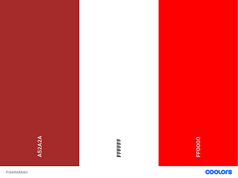
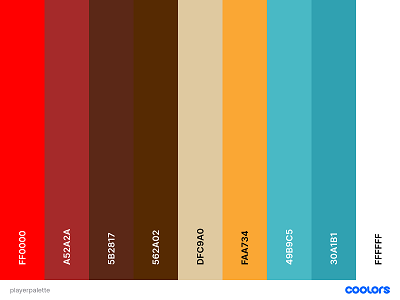
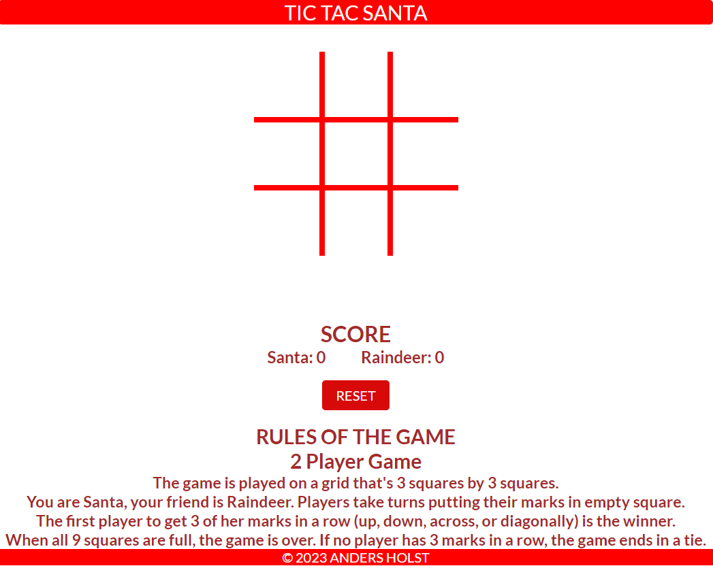

# Tic Tac Santa 
Tic-tac-toe (America English), noughts and crosses (Commonwealth English), or Xs and Os (Canadian or Irish English) is a paper and pancile game for 2 players who take turns marking the squares in a three by three grid with X or O. The player who succeds in plasing three of their marks in a horizontal, vertical, or diagonal row is the winner. It is a solved game, with a forced draw assuming best play from both players.

The Tic Tac Santa page is live, the link to the page can be found <a href="https://andersh82.github.io/TicTacSanta/" rel="nofollow">HERE</a>

## Table of Contents
+ [UX](#ux "UX")
  + [Site Purpose](#site-purpose "Site Purpose")
  + [Site Goal](#site-goal "SIte Goal")
  + [Audience](#audience "Audience")
  + [User Goal](#user-goal "User Goal")
+ [Design](#design "Design")
  + [Colour Scheme](#colour-scheme "Colour Scheme")
  + [Typography](#typography "Typography")
+ [Features](#features "Features")
  + [Landing Page](#landing-page "Landing Page")
+ [Testing](#testing "Testing")
  + [Validation Testing](#validation-testing "Validation Testing")
  + [JavaScript Testing](#javascript-testing "JavaScript Testing")
  + [Lighthouse Testing](#lighthouse-testing "Lighthouse Testing")
  + [Unfixed Bugs](#unfixed-bugs "Unfixed Bugs")
+ [Technologies Used](#technologies-used "Technologies Used")
  + [Languages Used](#languages-used "Languages Used")
  + [Frameworks, Libraries & Program Used](#frameworks-libraries-program-used "Frameworks, Libraries & Program Used")
+ [Deployment](#deployment "Deployment")
+ [Credits](#credits "Credits")
  + [Content](#Content "Content")
  + [Media](#media "Media")

## UX

### Site Purpose
The site aims to make people have a little fun during the stress of Christmas

### Site Goal
To regularly update our current users with the latest information about upcoming updates and new game features.

### Audience
For everyone who loves small simple games. Our market is for those who like old honest games. Male and female aged 0-99.

### User Goal
To see regular updates of the game and functions.
To navigate the site ease & clearly understand se information that is being shown.
For the information to be up-to-date.

## Design

### Colour Scheme
This colours is used for the text, board, header, footer and button.

 

His colours is used for tha player santa and raindeer.

The palette is from Coolors<a href="https://coolors.co/"> Click here!</a>

### Typography

Uses font "Lato" for a smooth texture and for the text to be visible to players on different screen sizes.

If you want this font, it can be found here Google Fonts. <a href="https://fonts.google.com/specimen/Lato?query=lato">Click here!</a>

## Features

### Landing Page

Here is the landing page.

And you can visit the website here. <a href="https://https://andersh82.github.io/TicTacSanta/">Click here!</a>

## Testing

### Validation Testing

### JavaScript Testing

### Lighthouse Testing

### Unfixed Bugs

## Technologies Used

### Languages Used

### Frameworks, Libraries & Program Used

## Deployment

## Credits

### Content

### Media