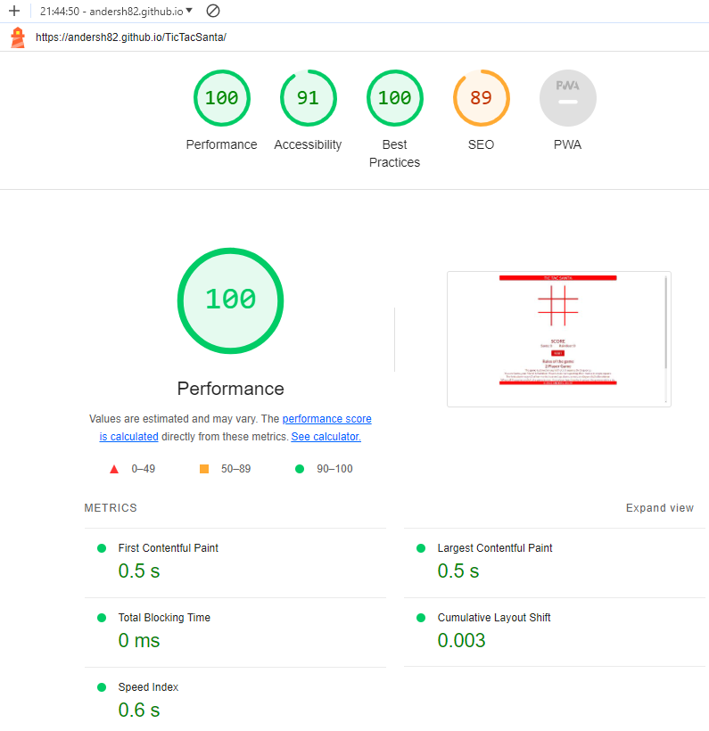

# Tic Tac Santa 
Tic-tac-toe (American English), noughts and crosses (Commonwealth English), or Xs and Os (Canadian or Irish English) is a paper and pencil game for 2 players who take turns marking the squares in a three-by-three grid with X or O. The player who succeeds in placing three of their marks in a horizontal, vertical, or diagonal row is the winner. It is a solved game, with a forced draw assuming the best play from both players.

The Tic Tac Santa page is live, the link to the page can be found <a href="https://andersh82.github.io/TicTacSanta/" rel="nofollow">HERE</a>

## Table of Contents
+ [UX](#ux "UX")
  + [Site Purpose](#site-purpose "Site Purpose")
  + [Site Goal](#site-goal "SIte Goal")
  + [Audience](#audience "Audience")
  + [User Goal](#user-goal "User Goal")
+ [Design](#design "Design")
  + [Color Scheme](#color-scheme "Color Scheme")
  + [Typography](#typography "Typography")
  + [Wireframe](#wireframe "Wireframe")
+ [Features](#features "Features")
  + [Landing Page](#landing-page "Landing Page")
+ [Testing](#testing "Testing")
  + [Validation Testing](#validation-testing "Validation Testing")
  + [JavaScript Testing](#javascript-testing "JavaScript Testing")
  + [Lighthouse Testing](#lighthouse-testing "Lighthouse Testing")
  + [Unfixed Bugs](#unfixed-bugs "Unfixed Bugs")
+ [Technologies Used](#technologies-used "Technologies Used")
  + [Languages Used](#languages-used "Languages Used")
  + [Frameworks, Libraries & Programs Used](#frameworks-libraries-programs-used "Frameworks, Libraries & Programs Used")
+ [Deployment](#deployment "Deployment")
+ [Credits](#credits "Credits")
  + [Content](#Content "Content")
  + [Acknowledgments](#acknowledgments "Acknowledgments")

## UX

### Site Purpose
The site aims to make people have a little fun during the stress of Christmas

### Site Goal
To regularly update our current users with the latest information about upcoming updates and new game features.

### Audience
For everyone who loves small simple games. Our market is for those who like old honest games. Male and female aged 0-99.

### User Goal
To see regular updates of the game and functions.
To navigate the site easily & clearly understand the information that is being shown.
For the information to be up-to-date.

## Design

### Color Scheme
These colors are used for the text, board, header, footer, and button.

 

His colors are used for the players Santa and Raindeer.

The palette is from Coolors<a href="https://coolors.co/"> Click here!</a>

### Typography

It uses the font "Lato" for a smooth texture for the text to be visible to players on different screen sizes.

If you want this font, it can be found here Google Fonts. <a href="https://fonts.google.com/specimen/Lato?query=lato">Click here!</a>

### Wireframe

Dekstop wireframe

Mobile wireframe

## Features

### Landing Page

This defines the feel of the website, providing the user with an image so that they can easily see what they have to do.

Here is the 404.html page.

You can visit the website here. <a href="https://https://andersh82.github.io/TicTacSanta/">Click here!</a>

## Testing

### Validation Testing

- Here is the answer from W3C Markup Validation of HTML.

- Here is the link to validate the live website <a href="https://validator.w3.org/nu/?doc=https%3A%2F%2Fandersh82.github.io%2FTicTacSanta%2F"> HERE</a>

- Here is the answer from W3C CSS Validation for CSS.

- Here is the link to validate the live website <a href="https://jigsaw.w3.org/css-validator/validator?uri=https%3A%2F%2Fandersh82.github.io%2FTicTacSanta%2F&profile=css3svg&usermedium=all&warning=1&vextwarning=&lang=sv">HERE</a>

Have one warning: Imported templates are not reviewed when entering directly or when uploading files.

### JavaScript Testing

Here is the test from Jshint

Here is the link to Jshint <a href="https://jshint.com/">HERE</a>

There is a warning on line 86 which is a loop but it does not disturb the game itself.

### Lighthouse Testing

Here is the desktop test.

and this is a test for the mobile.

### Unfixed Bugs

There is a bug that I found out a little too late to catch before submitting. This does not affect gameplay.
If you click in the same cell, it stores the player's images and then creates a cheat.

## Technologies Used

### Languages Used
 - Html
 - Css
 - JavaScript

### Frameworks, Libraries & Programs Used
 - Gitpod
 - Codeanywhere
 - Github
 - Replit (Desktop)
 - VS Code (Desktop)
 - Google Fonts 
 - Freepik (Favicon, Santa, and Raindeer)
 - Ui.dev  (Am I Responsive)
 - W3C Validator
 - Jshint
 - Balsamiq Wireframes
 - Grammarly
 - Youtube - Open Source Coding

## Deployment
For deployment to the GitHub website. The steps to deploy are as follows:

 - In the GitHub repository, navigate to the Settings 
 - From the source section drop-down menu, select the Master Branch
 - Once the master branch has been selected, the page will be automatically refreshed with a detailed ribbon display to indicate the successful deployment.
 - The live link can be found <a href="https://andersh82.github.io/TicTacSanta/">HERE</a>
## Credits

### Content

| Source | Location | Notes |
| --- | --- | --- |
| [Markdown Builder](https://tim.2bn.dev/markdown-builder) | README  | Help generate the Markdown files |

### Acknowledgements

- I would like to thank my Code Institute mentor, Rory Patrick Sheridan for his support throughout the development of this project.
- I would like to thank the Code Institute Slack community for the nov-2023-dfs-gut class for all the help.